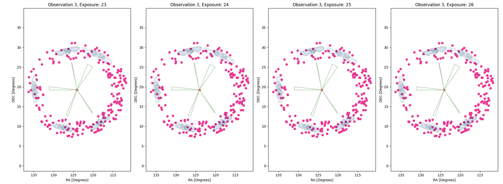
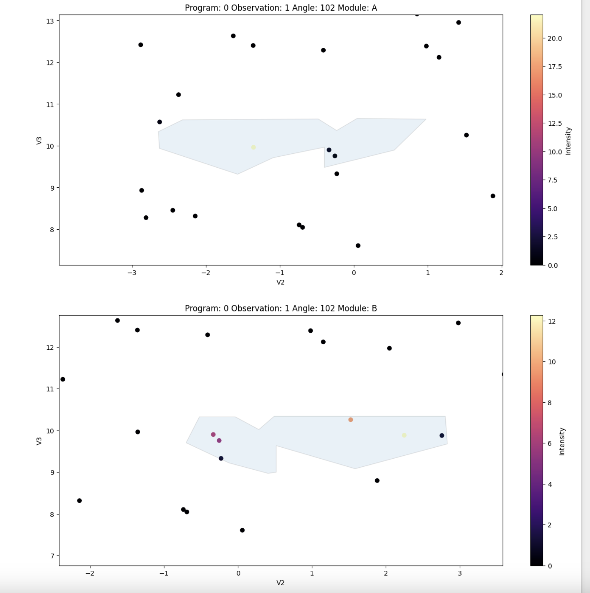
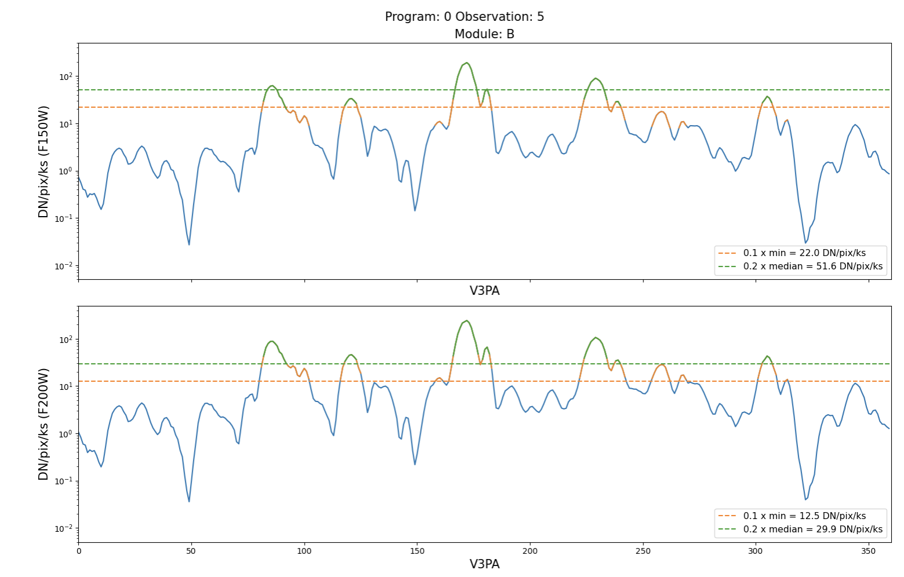

# The JWST Rogue Path Tool

Module to predict the presence of the stray-light artifacts know as claws in NIRCam Imaging observations.

## Installation for Users

To install `jwql`, simply use `pip`:

```
pip install jwql
```

To install from source:
1. Clone Git Repository
```
git clone git@github.com:spacetelescope/jwst_rogue_path_tool.git
```
2. Install requirements
```
pip install -e .
```

## Outputs

<p align="center">
  
</p>

<p align="center">
  
</p>

<p align="center">
  
</p>